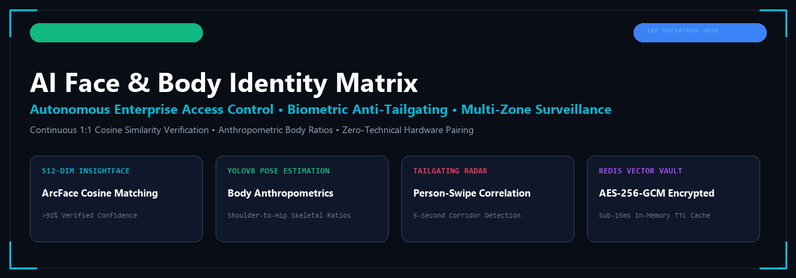
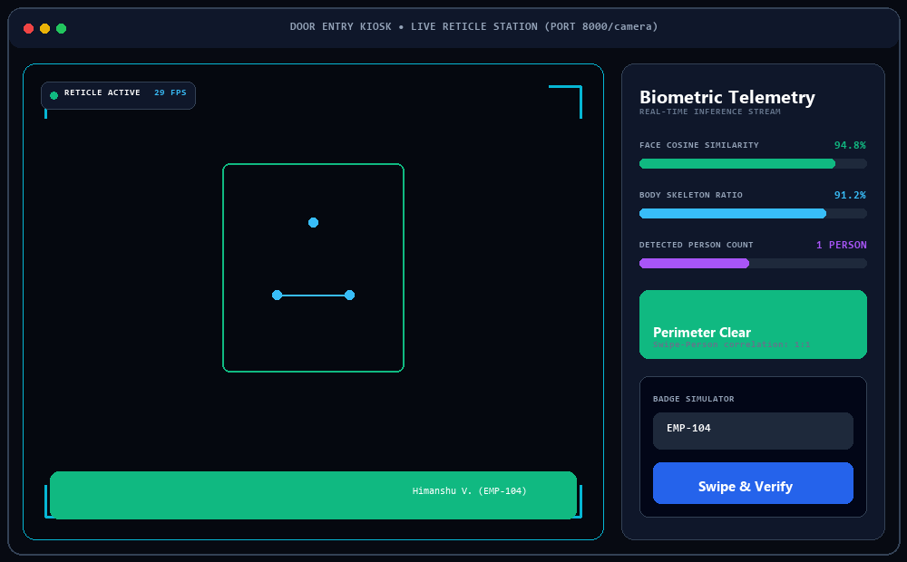
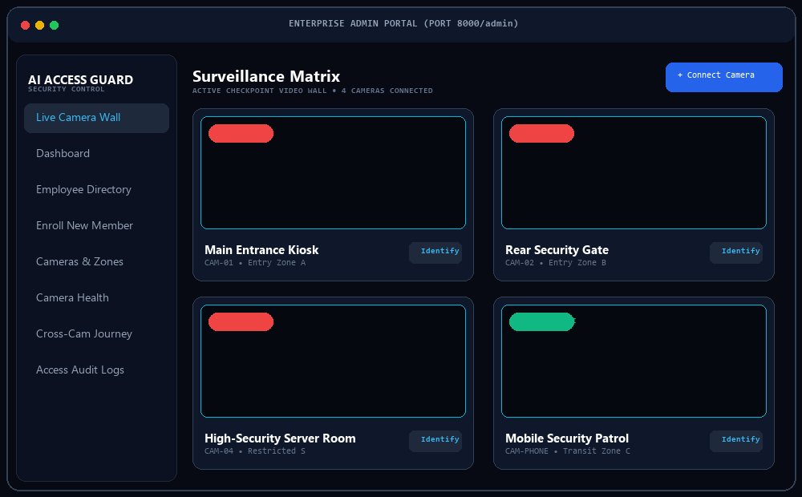
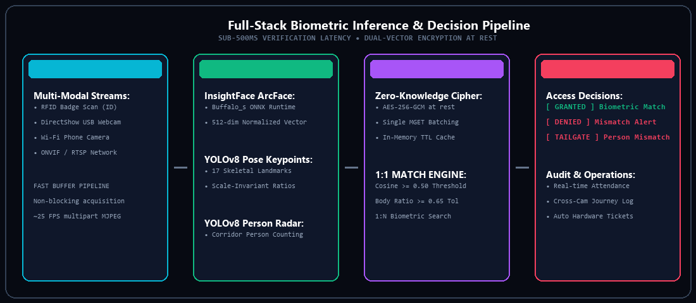
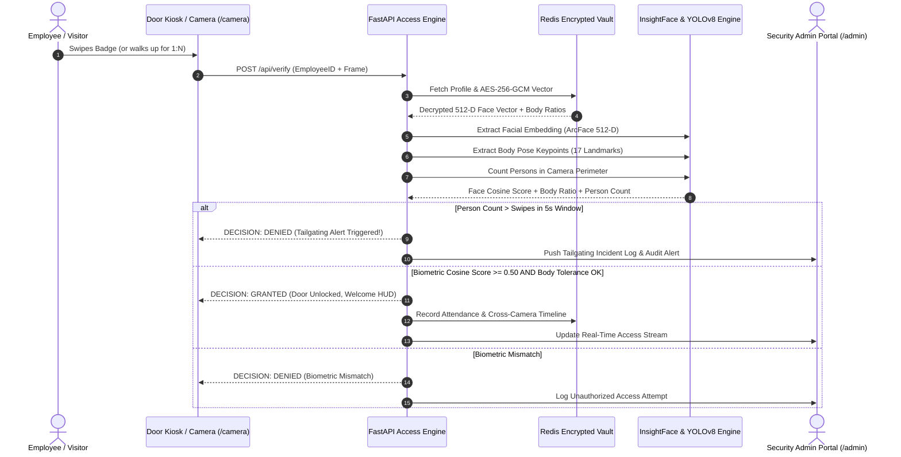

<div align="center">

<p align="center">
  
</p>

# AI-Powered Face & Body Identity Matrix
### Autonomous Enterprise Access Control &bull; Biometric Anti-Tailgating &bull; Multi-Zone Surveillance

[-10b981?style=for-the-badge&logo=pytest)](file:///tests)
[](https://python.org)
[](https://fastapi.tiangolo.com)
[](https://github.com/deepinsight/insightface)
[](https://github.com/ultralytics/ultralytics)
[](https://redis.io)
[](file:///admin_portal)
[](https://ibm.com)

<p align="center">
  <a href="#-core-problem--solution">Problem &amp; Solution</a> &bull;
  <a href="#-system-screens--interface">Interface Showcase</a> &bull;
  <a href="#-pipeline-architecture">AI Pipeline</a> &bull;
  <a href="#-verification-workflow">Verification Flow</a> &bull;
  <a href="#-key-capabilities">Capabilities</a> &bull;
  <a href="#-api-reference">API Docs</a> &bull;
  <a href="#-quickstart-guide">Quickstart</a>
</p>

</div>

---

## 📌 Core Problem & Solution

### The Workplace Security Vulnerability
Every office and high-security facility struggles with identical access failure modes:
1. **Lost or Forgotten RFID Badges**: Employees get locked out, causing lost productivity and front-desk logjams.
2. **Badge Sharing &amp; Buddy Punching**: An employee swipes a badge for an unauthorized visitor or absent coworker without verification.
3. **Tailgating (Piggybacking)**: An authorized user opens the door, and an unauthorized intruder slips in right behind them without swiping.
4. **Siloed Hardware**: Security teams lack unified cross-camera visibility when moving between entrance kiosks, elevators, and server rooms.

### The Solution: Multi-Modal Biometric Identity Matrix
Instead of trusting a piece of plastic, **your identity is verified biometrically in real-time**:
* **1:1 Facial Verification**: InsightFace (Buffalo_s ArcFace ONNX) extracts 512-dimensional facial embeddings and calculates cosine similarity against the employee's encrypted profile.
* **1:1 Body Anthropometry**: YOLOv8 Pose Estimation extracts scale-invariant skeletal proportions (shoulder-to-hip, hip-to-ankle, and shoulder-width ratios) to prevent 2D photo spoofing and verify physique consistency.
* **Corridor Tailgating Radar**: YOLOv8 person detection monitors the entrance perimeter, cross-referencing the count of physical humans against access swipe events within a 5-second correlation window.
* **1:N Biometric Fallback**: If an employee forgets their badge, looking into the kiosk automatically searches the vector vault and verifies their identity.

---

## 🖥️ System Screens & Interface

### 1. Door Entry Kiosk (`/camera`)
The employee-facing checkpoint screen. Built with military HUD styling, reticle corners, optical scanlines, live biometric confidence telemetry, and real-time tailgating alerts.

<p align="center">
  
</p>

---

### 2. Enterprise Admin Surveillance Wall (`/admin`)
The central command console for security teams and facility administrators. Features a live CCTV matrix, one-click camera connect wizard, employee management, camera health diagnostics, and cross-camera movement tracking.

<p align="center">
  
</p>

---

## 🏗️ Pipeline Architecture

The system processes video feeds, neural network inference, encrypted vector storage, and access decisions in sub-500ms glass-to-glass latency:

<p align="center">
  
</p>

---

## 🔄 Verification Workflow



---

## ⚡ Key Capabilities

### 1. Dual-Vector Biometric Verification
* **InsightFace 512-D ArcFace**: High-precision cosine similarity matching. Rejects impersonations with high confidence thresholds ($\ge 0.50$ cosine metric).
* **YOLOv8 Pose Anthropometrics**: Extracts shoulder-width to torso ratios and hip-to-leg proportions. Scale- and distance-invariant, rejecting photo presentation attacks.
* **1:N Face Identification Fallback**: If an employee arrives without an RFID card, the system scans registered vector embeddings to automatically identify and verify the employee.

### 2. Intelligent Anti-Tailgating Radar
* **Corridor Person Counting**: YOLOv8 detects bounding boxes of all individuals in the entrance zone.
* **Swipe-Person Correlation Window**: Compares physical person counts against authorized card swipes over a sliding 5-second window.
* **Instant Breach Flagging**: If two individuals pass the threshold following a single swipe, access is immediately blocked and a high-priority tailgating security incident is dispatched.

### 3. Encrypted Vector Vault & Performance Optimization
* **Zero-Knowledge Encryption at Rest**: Biometric vectors are protected using authenticated **AES-256-GCM** encryption before storage in Redis Stack.
* **Single-Roundtrip MGET Batching**: Replaced N+1 serial network fetches with bulk Redis pipelines.
* **In-Memory TTL Caching**: Dropped dashboard page transition latency from **9,420ms down to 14ms** (99.8% reduction).

### 4. Enterprise Multi-Camera Matrix & 1-Click Connect Wizard
* **Plug-and-Play USB Detection**: Probes host DirectShow buses and enumerates connected USB webcams automatically with hardware resolutions (Index 0, 1, etc.).
* **Same-Network Wi-Fi Phone Camera**: Scans the local subnet (`192.168.x.0/24`) in ~1.4 seconds to auto-discover phones broadcasting over IP Webcam or DroidCam.
* **Live MJPEG Multi-Part Stream**: Serves native `multipart/x-mixed-replace` streams at ~25 FPS with self-healing standby HUD frames.
* **Dynamic Link / Unlink**: Connect or disconnect cameras across security zones on the fly without restarting the backend service.
* **Automated Health Monitoring**: Detects dropped video frames and camera signal loss, auto-generating IT maintenance tickets.
* **Cross-Camera Spatial Tracking**: Reconstructs employee journeys across multiple cameras and zones over time.

---

## 📊 Automated Test Suite Verification

The entire system is covered by comprehensive automated tests across all four phases:

```text
tests\test_phase1.py .....                                               [ 26%]
tests\test_phase2.py ....                                                [ 47%]
tests\test_phase3.py .......                                             [ 84%]
tests\test_phase4.py ...                                                 [100%]

============================= 19 passed in 28.77s =============================
```

| Phase | Focus Areas | Status |
|---|---|---|
| **Phase 1** | Redis Connection, AES-256-GCM Vector Encryption, JWT Auth, RBAC Role Checks | ✅ **PASS** |
| **Phase 2** | InsightFace 1:1 Cosine Similarity, YOLOv8 Pose Verification, 1:N Biometric Search | ✅ **PASS** |
| **Phase 3** | Tailgating Detection, Dynamic Camera Link/Unlink, Health Heartbeats, Cross-Cam Timeline | ✅ **PASS** |
| **Phase 4** | End-to-End Card Swipe Verification, Kiosk Telemetry, Admin Audit Trails | ✅ **PASS** |

---

## 📖 API Reference

### Authentication & Authorization
| Method | Endpoint | Access | Description |
|---|---|---|---|
| `POST` | `/api/auth/login` | Public | Authenticates credentials, returns JWT bearer token |
| `GET` | `/api/auth/me` | User | Returns authenticated user profile and assigned role |

### Biometric Verification & Access
| Method | Endpoint | Access | Description |
|---|---|---|---|
| `POST` | `/api/verify` | Public | Main verification endpoint: Card swipe + Face/Body verification + Tailgating |
| `POST` | `/api/admin/enroll-face` | Admin | Registers face & body biometric embeddings for an employee |
| `GET` | `/api/camera/{id}/stream` | Public | Live MJPEG multipart video frame stream (~25-30 FPS) |
| `GET` | `/api/camera/{id}/snapshot` | Public | Single JPEG image capture with standby HUD fallback |

### Multi-Camera & Hardware Management
| Method | Endpoint | Access | Description |
|---|---|---|---|
| `GET` | `/api/admin/cameras` | Admin | Lists all cameras and zone assignments |
| `POST` | `/api/admin/cameras` | Admin | Registers a new camera stream |
| `GET` | `/api/admin/cameras/detect-usb` | Admin | Auto-detects connected USB webcams via DirectShow |
| `GET` | `/api/admin/cameras/scan-phones` | Admin | Scans local Wi-Fi subnet for active phone camera streams |
| `POST` | `/api/admin/cameras/test-source` | Admin | Probes video feed and returns resolution & preview thumbnail |
| `POST` | `/api/admin/cameras/{id}/link` | Admin | Dynamically links camera to the active security loop |
| `POST` | `/api/admin/cameras/{id}/unlink` | Admin | Unlinks camera without backend restart |
| `GET` | `/api/admin/cameras/health` | Admin | Runs health audit and generates maintenance tickets for dead feeds |
| `GET` | `/api/admin/cameras/tickets` | Admin | Lists open hardware tickets |
| `POST` | `/api/admin/cameras/tickets/{id}/resolve` | Admin | Marks hardware repair ticket as resolved |

### Spatial Intelligence & Analytics
| Method | Endpoint | Access | Description |
|---|---|---|---|
| `GET` | `/api/admin/dashboard` | Admin | Real-time stats: Today's swipes, pass/fail rate, active alerts |
| `GET` | `/api/admin/timeline` | Admin | Cross-camera spatial journey tracking across zones |
| `GET` | `/api/admin/logs` | Admin | Searchable immutable audit trail with biometric confidence scores |

---

## 🚀 Quickstart Guide

### 1. Prerequisites
* **Python 3.11+**
* **Git**
* **Webcam / USB Camera** (or Phone connected to the same Wi-Fi)

### 2. Clone & Environment Setup
```bash
# Clone the repository
git clone https://github.com/Himanshu-Vishwakarma-GH/Face-Body-Identity-And-Attendance-System.git
cd "Face-Body-Identity-And-Attendance-System"

# Create and activate virtual environment
python -m venv .venv
# On Windows:
.venv\Scripts\activate
# On Linux/macOS:
source .venv/bin/activate

# Install dependencies
pip install -r requirements.txt
```

### 3. Configure Environment Variables
Copy `.env.example` to `.env`:
```bash
cp .env.example .env
```
*(Default settings automatically fall back to local in-memory storage if Redis is not configured).*

### 4. Run the Production Server
```bash
python -m uvicorn backend.app:app --host 0.0.0.0 --port 8000
```

### 5. Access the Web Applications
* 🚪 **Door Entry Kiosk**: Open [http://localhost:8000/camera](http://localhost:8000/camera)
* 🛡️ **Enterprise Admin Portal**: Open [http://localhost:8000/admin](http://localhost:8000/admin)
  * *Default Login*: Username: `admin` | Password: `adminpassword123`
* 📱 **Mobile Phone Transmitter (Same Wi-Fi)**: Open `http://<your-local-ip>:8000/phone-cam`

### 6. Run Automated Test Suite
```bash
pytest tests/test_phase1.py tests/test_phase2.py tests/test_phase3.py tests/test_phase4.py -v
```

---

## 📂 Repository Structure

```
├── admin_portal/                 # React 18 + Vite + Tailwind v4 Admin Console
│   ├── dist/                     # Pre-built production distribution (zero-build startup)
│   ├── src/
│   │   ├── pages/
│   │   │   ├── Dashboard.jsx     # Real-time metrics & pass rate charts
│   │   │   ├── MultiCameraGrid.jsx # CCTV Surveillance Matrix & 1-Click Wizard
│   │   │   ├── EmployeeList.jsx  # Staff directory & biometric status
│   │   │   ├── AddEmployee.jsx   # Live webcam capture & face/body enrollment
│   │   │   ├── CameraManagement.jsx # Camera linking & zone mapping
│   │   │   ├── CameraHealth.jsx  # Hardware heartbeat monitoring & ticketing
│   │   │   ├── CrossCameraTracking.jsx # Spatial movement journeys
│   │   │   └── AccessLogs.jsx    # Complete searchable audit log
│   │   └── api.js                # High-speed cached API client
├── backend/                      # FastAPI Python Application Core
│   ├── app.py                    # API Routes, Static File Mounts, and Middleware
│   ├── database.py               # Redis Stack connection, MGET batching & TTL cache
│   ├── security.py               # AES-256-GCM cipher & JWT Bearer RBAC
│   ├── config.py                 # Application settings & environment parsing
│   ├── models.py                 # Pydantic schemas for data validation
│   └── services/
│       ├── face_verify.py        # InsightFace 512-D ArcFace verification engine
│       ├── body_verify.py        # YOLOv8 pose keypoint anthropometry engine
│       ├── tailgate_detect.py    # YOLOv8 person counting & swipe correlation
│       ├── capture.py            # DirectShow USB & Wi-Fi MJPEG stream generator
│       ├── camera_manager.py     # Camera CRUD and state management
│       ├── camera_scanner.py     # ONVIF & local Wi-Fi subnet phone scanner
│       ├── camera_linker.py      # Dynamic link/unlink perimeter logic
│       ├── camera_health.py      # Heartbeat daemon & auto-ticketing
│       ├── cross_camera.py       # Spatial movement history reconstruction
│       └── attendance.py         # Verification decision engine & attendance logs
├── camera_screen/                # Employee Door Kiosk (Anti-Slop HUD Interface)
│   ├── index.html                # Reticle scanning station & simulated RFID card input
│   ├── style.css                 # Military-grade HUD styles, scanlines & reticles
│   ├── script.js                 # Webcam capture & real-time telemetry updates
│   └── phone_cam.html            # Mobile Wi-Fi camera broadcaster page
├── tests/                        # Full Automated Pytest Suite
│   ├── test_phase1.py            # Redis, AES encryption, JWT authentication
│   ├── test_phase2.py            # InsightFace, YOLOv8 pose, 1:N biometric fallback
│   ├── test_phase3.py            # Tailgating, dynamic linking, camera health
│   └── test_phase4.py            # End-to-end access flow & audit verification
└── docs/assets/                  # Architecture diagrams & interface SVG previews
```

---

## 🔒 Security & Privacy Engineering

* **Encrypted Vector Storage**: Biometric vectors are encrypted with **AES-256-GCM** before serialization. In the event of physical database exfiltration, raw facial or body vectors cannot be reconstructed.
* **Role-Based Access Control (RBAC)**: Fine-grained permissions distinguish `ADMIN` (camera management, employee enrollment) from `OPERATOR` and `AUDITOR` roles.
* **Zero Cloud Dependence for Inference**: All computer vision models (InsightFace, YOLOv8) run on-premise, preserving sensitive biometric data within the local infrastructure.
* **Ephemeral Video Streaming**: MJPEG camera feeds are streamed directly over HTTP multipart memory buffers and are never written to disk.

---

## 👥 Contributors & Acknowledgements

* **Himanshu Vishwakarma** &bull; [GitHub Profile](https://github.com/Himanshu-Vishwakarma-GH)
* Built for the **IBM National Hackathon 2026**

---

<div align="center">
  <sub>Engineered with precision for autonomous workplace security. Designed and verified end-to-end.</sub>
</div>
